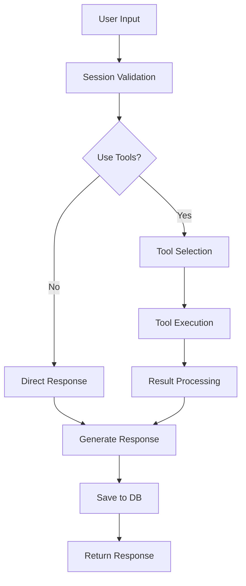

# LLM Agent 백엔드 개발 학습 가이드

> 이 문서는 LLM Agent Backend Server POC 프로젝트를 통해 학습한 내용을 정리한 것입니다.

## 📋 목차

1. [프로젝트 개요](#프로젝트-개요)
2. [핵심 아키텍처](#핵심-아키텍처)
3. [Agent 시스템 구현](#agent-시스템-구현)
4. [Tool Calling 메커니즘](#tool-calling-메커니즘)
5. [Fallback 및 에러 처리](#fallback-및-에러-처리)
6. [세션 및 데이터 관리](#세션-및-데이터-관리)
7. [API 설계 및 스트리밍](#api-설계-및-스트리밍)
8. [프로덕션 고려사항](#프로덕션-고려사항)
9. [학습 포인트 및 베스트 프랙티스](#학습-포인트-및-베스트-프랙티스)

---

## 🎯 프로젝트 개요

### 목표
- LLM Agent 개발 경험 습득
- Tool Calling 메커니즘 이해
- 프로덕션 레벨의 에러 처리 및 Fallback 시스템 구현
- 실시간 스트리밍 응답 처리

### 기술 스택
- **Backend**: FastAPI (비동기 웹 프레임워크)
- **LLM Integration**: OpenRouter (다양한 모델 접근)
- **Agent Framework**: LangChain
- **Session Storage**: Redis
- **Database**: SQLite (SQLAlchemy)
- **Testing**: pytest, httpx

---

## 🏗️ 핵심 아키텍처

### 레이어드 아키텍처

```
┌────────────────────────────────────────────────┐
│                  Presentation Layer             │
│                 (FastAPI Routes)                │
├────────────────────────────────────────────────┤
│                  Business Layer                 │
│            (Agents & Tool Execution)            │
├────────────────────────────────────────────────┤
│                  Service Layer                  │
│    (OpenRouter, Session Manager, Fallback)      │
├────────────────────────────────────────────────┤
│                    Data Layer                   │
│            (Redis + SQLite + SQLAlchemy)        │
└────────────────────────────────────────────────┘
```

### 주요 디자인 패턴

#### 1. **Factory Pattern** - Tool 관리
```python
# app/tools/__init__.py
AVAILABLE_TOOLS: Dict[str, Type[BaseTool]] = {
    "calculator": CalculatorTool,
    "weather": WeatherTool,
    "search": SearchTool,
}

def get_tool(tool_name: str) -> BaseTool:
    if tool_name not in AVAILABLE_TOOLS:
        raise ValueError(f"Tool '{tool_name}' not found")
    return AVAILABLE_TOOLS[tool_name]()
```

#### 2. **Strategy Pattern** - 다양한 Agent 구현
```python
# 상황에 따른 다른 Agent 전략 사용
- ChatAgent: 기본 OpenRouter 연동
- LangChainAgent: 고급 기능 (메모리, 계획 수립)
- SimpleAgent: POC용 간단한 구현
```

#### 3. **Chain of Responsibility** - Fallback 시스템
```python
# 모델 실패 시 순차적으로 다음 모델 시도
fallback_models = [
    "deepseek/deepseek-chat-v3-0324:free",
    "google/gemini-2.0-flash-exp:free", 
    "qwen/qwen3-235b-a22b-07-25:free"
]
```

---

## 🤖 Agent 시스템 구현

### 1. 기본 Agent 구조

```python
class ChatAgent:
    def __init__(self, use_fallback: bool = True):
        # 클라이언트 초기화
        if use_fallback:
            self.openrouter_client = OpenRouterFallbackClient()
        else:
            self.openrouter_client = OpenRouterClient()
        
        # Mock 클라이언트 (Rate limit 대응)
        self.mock_client = MockOpenRouterClient()
        self.use_mock_mode = False
```

### 2. LangChain Agent 구현

```python
class LangChainAgent:
    def __init__(self, session_id: str):
        # 메모리 설정 - 대화 기록 유지
        self.memory = ConversationBufferMemory(
            memory_key="chat_history",
            return_messages=True
        )
        
        # OpenRouter를 통한 LLM 설정
        self.llm = ChatOpenAI(
            base_url=settings.openrouter_base_url,
            api_key=settings.openrouter_api_key,
            model=settings.default_model,
            streaming=True
        )
        
        # Agent 생성
        self.agent_executor = self._create_agent()
```

### 3. Agent 처리 플로우



---

## 🛠️ Tool Calling 메커니즘

### 1. Tool 기본 구조

```python
class BaseTool(ABC):
    @property
    @abstractmethod
    def name(self) -> str:
        pass
    
    @property
    @abstractmethod
    def description(self) -> str:
        pass
    
    @abstractmethod
    async def execute(self, **kwargs) -> Dict[str, Any]:
        pass
    
    def to_openai_function(self) -> Dict[str, Any]:
        """OpenAI Function Calling 형식으로 변환"""
        return {
            "type": "function",
            "function": {
                "name": self.name,
                "description": self.description,
                "parameters": {...}
            }
        }
```

### 2. Tool 구현 예시 - Calculator

```python
class CalculatorTool(BaseTool):
    async def execute(self, expression: str) -> Dict[str, Any]:
        try:
            # 안전한 수식 평가
            safe_dict = {
                'sqrt': math.sqrt,
                'pow': math.pow,
                'sin': math.sin,
                # ... 안전한 함수들만 허용
            }
            
            # 위험한 문자 제거
            expression = expression.replace('__', '').replace('import', '')
            
            # 평가
            result = eval(expression, {"__builtins__": {}}, safe_dict)
            
            return {
                "success": True,
                "result": result,
                "expression": expression
            }
        except Exception as e:
            return {
                "success": False,
                "error": str(e)
            }
```

### 3. Tool 실행 프로세스

```python
# Tool이 필요한 경우 처리
if message.tool_calls:
    tool_results = []
    
    for tool_call in message.tool_calls:
        tool_name = tool_call.function.name
        tool_args = json.loads(tool_call.function.arguments)
        
        # Tool 실행
        tool = get_tool(tool_name)
        result = await tool.execute(**tool_args)
        
        tool_results.append({
            "tool_call_id": tool_call.id,
            "tool_name": tool_name,
            "result": result
        })
```

---

## 🔄 Fallback 및 에러 처리

### 1. 다단계 Fallback 시스템

```python
async def chat_completion_with_fallback(self, messages, use_tools=True):
    # 사용 가능한 모델 목록
    fallback_models = get_fallback_models(
        require_tools=use_tools,
        free_only=True
    )
    
    # 각 모델로 순차적 시도
    last_error = None
    for model_config in fallback_models:
        try:
            result = await self._try_model(
                model_id=model_config.id,
                messages=messages,
                tools=tools if model_config.supports_tools else None
            )
            
            if result["success"]:
                return await self._process_response(result["response"])
            else:
                last_error = result["error"]
                
        except Exception as e:
            last_error = str(e)
            if "Invalid API key" in last_error:
                break  # API 키 문제는 더 시도해도 소용없음
    
    # 모든 모델 실패 시
    return {"content": f"All models failed: {last_error}"}
```

### 2. Rate Limit 대응 - Mock Mode

```python
# Rate limit 감지 및 Mock 모드 전환
if "Rate limit exceeded" in error_msg or "429" in error_msg:
    logger.warning("Rate limit detected, switching to mock mode")
    self.use_mock_mode = True
    response = await self.mock_client.chat_completion_with_fallback(
        messages=chat_messages,
        use_tools=use_tools
    )
```

### 3. Mock Client 구현

```python
class MockOpenRouterClient:
    async def chat_completion_with_fallback(self, messages, use_tools=True):
        user_message = self._extract_user_message(messages)
        
        # Tool 사용 필요성 판단
        if use_tools:
            # 계산 요청 감지
            if self._is_calculation_request(user_message):
                tool_calls = await self._mock_calculator_call(user_message)
                return self._create_tool_response(tool_calls)
            
            # 날씨 요청 감지
            elif self._is_weather_request(user_message):
                tool_calls = await self._mock_weather_call(user_message)
                return self._create_tool_response(tool_calls)
        
        # 일반 응답
        return self._create_general_response(user_message)
```

---

## 💾 세션 및 데이터 관리

### 1. Redis 세션 관리

```python
class SessionManager:
    async def create_session(self) -> str:
        session_id = str(uuid.uuid4())
        session_data = {
            "created_at": datetime.utcnow().isoformat(),
            "messages": [],
            "context": {}
        }
        
        # TTL과 함께 저장
        await self.redis_client.setex(
            f"session:{session_id}",
            settings.redis_session_ttl,  # 1시간
            json.dumps(session_data)
        )
        return session_id
    
    async def add_message(self, session_id: str, role: str, content: str):
        # 세션 데이터 가져오기
        session_data = await self.get_session(session_id)
        
        # 메시지 추가
        message = {
            "role": role,
            "content": content,
            "timestamp": datetime.utcnow().isoformat()
        }
        session_data["messages"].append(message)
        
        # 최근 20개 메시지만 유지 (메모리 최적화)
        if len(session_data["messages"]) > 20:
            session_data["messages"] = session_data["messages"][-20:]
```

### 2. SQLite 영구 저장

```python
class ChatHistory(Base):
    __tablename__ = "chat_history"
    
    id = Column(Integer, primary_key=True)
    session_id = Column(String(100), index=True)
    user_message = Column(Text)
    assistant_message = Column(Text)
    tools_used = Column(JSON)  # ["calculator", "weather"]
    model_used = Column(String(100))
    tokens_used = Column(Integer)
    cost = Column(Float)
    created_at = Column(DateTime, default=datetime.utcnow)
    metadata = Column(JSON)  # 추가 메타데이터
```

### 3. 비동기 데이터베이스 작업

```python
async def _save_to_database(self, session_id, user_message, assistant_message):
    async with AsyncSessionLocal() as db:
        chat_history = ChatHistory(
            session_id=session_id,
            user_message=user_message,
            assistant_message=assistant_message,
            tools_used=tools_used,
            model_used=metadata.get("model", "unknown")
        )
        db.add(chat_history)
        await db.commit()
```

---

## 🌐 API 설계 및 스트리밍

### 1. RESTful API 엔드포인트

```python
@router.post("/api/chat/session")
async def create_session() -> SessionResponse:
    """새 세션 생성"""
    session_id = await session_manager.create_session()
    return SessionResponse(session_id=session_id)

@router.post("/api/chat/message")
async def send_message(request: ChatRequest) -> ChatResponse:
    """메시지 전송 (일반 응답)"""
    result = await chat_agent.process_message(
        session_id=request.session_id,
        user_message=request.message,
        use_tools=request.use_tools
    )
    return ChatResponse(...)

@router.get("/api/chat/history/{session_id}")
async def get_chat_history(session_id: str) -> List[Dict]:
    """대화 기록 조회"""
    return await chat_agent.get_chat_history(session_id)
```

### 2. Server-Sent Events (SSE) 스트리밍

```python
@router.post("/api/chat/message/stream")
async def stream_message(request: ChatRequest):
    """스트리밍 응답"""
    async def generate():
        # 메타데이터 전송
        yield {
            "event": "metadata",
            "data": json.dumps({
                "agent": agent_type,
                "model": model_used
            })
        }
        
        # 스트리밍 응답
        async for chunk in agent.stream_response():
            yield {
                "event": "message",
                "data": json.dumps({"content": chunk})
            }
        
        # 완료 신호
        yield {
            "event": "done",
            "data": json.dumps({"status": "completed"})
        }
    
    return EventSourceResponse(generate())
```

### 3. Pydantic 모델 검증

```python
class ChatRequest(BaseModel):
    message: str = Field(..., min_length=1)
    use_tools: bool = Field(True)
    session_id: Optional[str] = Field(None)
    model: Optional[str] = Field(None)
    temperature: float = Field(0.7, ge=0, le=2)
    max_tokens: int = Field(1000, ge=1, le=4000)
```

---

## 🚀 프로덕션 고려사항

### 1. 성능 최적화

```python
# 1. 연결 풀링
self.client = httpx.AsyncClient(
    limits=httpx.Limits(
        max_keepalive_connections=10,
        max_connections=100
    )
)

# 2. 캐싱 전략
@lru_cache(maxsize=100)
def get_cached_tool_result(tool_name: str, params_hash: str):
    return tool_results.get(params_hash)

# 3. 백그라운드 작업
from fastapi import BackgroundTasks

@router.post("/api/chat/message")
async def send_message(
    request: ChatRequest,
    background_tasks: BackgroundTasks
):
    # 즉시 응답
    response = await get_quick_response()
    
    # DB 저장은 백그라운드에서
    background_tasks.add_task(
        save_to_database,
        session_id, user_message, response
    )
    
    return response
```

### 2. 보안 고려사항

```python
# 1. API 키 관리
from pydantic_settings import BaseSettings

class Settings(BaseSettings):
    openrouter_api_key: str  # 환경변수에서 자동 로드
    
    class Config:
        env_file = ".env"
        env_file_encoding = "utf-8"

# 2. 입력 검증
def sanitize_expression(expression: str) -> str:
    # 위험한 패턴 제거
    dangerous_patterns = ['__', 'import', 'exec', 'eval', 'open']
    for pattern in dangerous_patterns:
        expression = expression.replace(pattern, '')
    return expression

# 3. Rate Limiting (TODO)
from slowapi import Limiter
limiter = Limiter(key_func=get_remote_address)

@router.post("/api/chat/message")
@limiter.limit("10/minute")
async def send_message(request: Request):
    pass
```

### 3. 모니터링 및 로깅

```python
# 구조화된 로깅
import structlog

logger = structlog.get_logger()

logger.info(
    "api_request",
    endpoint="/api/chat/message",
    session_id=session_id,
    model_used=model,
    tokens_used=tokens,
    response_time=response_time
)

# 메트릭 수집 (Prometheus)
from prometheus_client import Counter, Histogram

request_count = Counter(
    'chat_requests_total',
    'Total chat requests',
    ['endpoint', 'model', 'status']
)

response_time = Histogram(
    'chat_response_duration_seconds',
    'Chat response time',
    ['endpoint', 'model']
)
```

---

## 📚 학습 포인트 및 베스트 프랙티스

### 1. 비동기 프로그래밍

```python
# ✅ Good: 비동기 I/O 활용
async def process_multiple_tools(tools):
    tasks = [tool.execute() for tool in tools]
    results = await asyncio.gather(*tasks)
    return results

# ❌ Bad: 동기적 처리
def process_multiple_tools(tools):
    results = []
    for tool in tools:
        results.append(tool.execute())  # 블로킹
    return results
```

### 2. 에러 처리 패턴

```python
# 계층적 에러 처리
try:
    # 비즈니스 로직
    response = await agent.process()
except RateLimitError:
    # 특정 에러 처리
    response = await use_fallback()
except OpenRouterError as e:
    # API 에러 처리
    logger.error("API error", error=str(e))
    raise HTTPException(status_code=503)
except Exception as e:
    # 예상치 못한 에러
    logger.exception("Unexpected error")
    raise HTTPException(status_code=500)
```

### 3. 확장 가능한 설계

```python
# 새로운 Tool 추가가 쉬운 구조
class NewTool(BaseTool):
    @property
    def name(self) -> str:
        return "new_tool"
    
    async def execute(self, **kwargs):
        # 구현만 하면 자동으로 등록됨
        pass

# tools/__init__.py에 추가
AVAILABLE_TOOLS["new_tool"] = NewTool
```

### 4. 테스트 전략

```python
# 1. Mock을 활용한 단위 테스트
@pytest.mark.asyncio
async def test_calculator_tool():
    tool = CalculatorTool()
    result = await tool.execute(expression="2 + 2")
    assert result["success"] is True
    assert result["result"] == 4

# 2. 통합 테스트
@pytest.mark.asyncio
async def test_chat_endpoint(client: AsyncClient):
    # 세션 생성
    session_resp = await client.post("/api/chat/session")
    session_id = session_resp.json()["session_id"]
    
    # 메시지 전송
    chat_resp = await client.post(
        "/api/chat/message",
        json={
            "session_id": session_id,
            "message": "Calculate 10 * 20",
            "use_tools": True
        }
    )
    
    assert chat_resp.status_code == 200
    assert "200" in chat_resp.json()["response"]
```

### 5. 문서화

```python
@router.post(
    "/api/chat/message",
    response_model=ChatResponse,
    summary="Send a chat message",
    description="""
    Send a message to the chat agent.
    
    The agent will:
    1. Analyze the message
    2. Determine if tools are needed
    3. Execute tools if necessary
    4. Generate a response
    
    Use `use_tools=false` to disable tool usage.
    """
)
async def send_message(request: ChatRequest):
    pass
```

---

## 🎯 핵심 배운 점

### 1. **Agent 개발의 복잡성**
- 단순한 API 호출을 넘어서 컨텍스트 관리, 도구 실행, 에러 처리 등 고려할 사항이 많음
- 사용자 경험을 위한 스트리밍, 세션 관리 등이 중요

### 2. **Fallback의 중요성**
- 외부 API 의존성이 높을수록 견고한 fallback 시스템 필수
- Rate limit, 모델 실패 등 다양한 시나리오 대비 필요

### 3. **Tool Calling 설계**
- 명확한 인터페이스 정의가 확장성의 핵심
- 안전성과 유연성의 균형이 중요

### 4. **비동기 아키텍처의 장점**
- I/O 바운드 작업이 많은 LLM 애플리케이션에 최적
- 동시성 처리로 성능 향상 가능

### 5. **프로덕션 준비**
- 로깅, 모니터링, 에러 처리가 개발 단계부터 중요
- 테스트 가능한 구조로 설계하는 것이 핵심

---

## 🚀 다음 단계

1. **고급 Agent 기능**
   - Multi-agent 협업
   - 장기 메모리 (Vector DB)
   - 복잡한 계획 수립

2. **프로덕션 개선**
   - Kubernetes 배포
   - 분산 캐싱 (Redis Cluster)
   - 실시간 모니터링 대시보드

3. **보안 강화**
   - OAuth2 인증
   - Rate limiting
   - 입력 필터링 강화

4. **성능 최적화**
   - 응답 캐싱
   - 모델 선택 최적화
   - 병렬 처리 개선

이 프로젝트는 LLM Agent 개발의 기초를 다지는 훌륭한 출발점이 되었습니다. 실제 프로덕션 환경에서는 더 많은 고려사항이 있겠지만, 핵심 개념과 패턴을 익히는 데 큰 도움이 되었습니다.